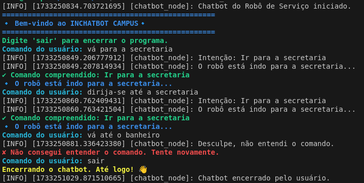

# InChatbot Campus

Chatbot simples para um robô de serviço que recebe comandos de um usuário e executa ações baseadas nas intenções fornecidas. O robô é capaz de se dirigir a diferentes locais do campus, como a secretaria, o laboratório, o refeitório, entre outros.



- O chatbot recebe comandos de texto do usuário.
- Comandos são processados e as intenções são verificadas usando expressões regulares.
- Ações são executadas com base nas intenções identificadas (por exemplo, "ir para a secretaria").
- Feedback é enviado para o tópico chatbot_feedback utilizando o ROS 2 (Robot Operating System 2).
- O chatbot exibe mensagens de boas-vindas e de erro quando o comando não é reconhecido.

## Requisitos

- ROS 2 (foi utilizado ROS 2 Foxy para este projeto)
- Python 3.x
- Pacotes ROS 2 necessários:
    std_msgs

## Instalação

- Instale o ROS 2 em seu sistema seguindo as instruções da documentação oficial do ROS 2.
- Instale as dependências necessárias para o seu ambiente ROS 2.
- Clone o repositório em seu workspace do ROS 2.

```bash
git clone https://github.com/rafaelarojas/chatbot
```

```bash
cd <DIRETORIO_DO_WORKSPACE>
```

```bash
colcon build
```

```bash
source install/setup.bash
```

```bash
ros2 run chatbot chatbot_node
```

### Comandos Reconhecidos

Os seguintes comandos são reconhecidos pelo chatbot:

    "ir para a secretaria"
    "ir para o laboratório"
    "ir para a biblioteca"
    "ir para o ateliê"
    "ir até o André para encher o saco dele"
    "ir para o refeitório"
    "ir para a recepção"
    "ir para a arquibancada"
    "ir para o auditório"

## Estrutura do Código

- Dicionário de Intenções (INTENTIONS): Mapeia palavras-chave para ações descritas.
- Dicionário de Ações (ACTIONS): Mapeia intenções para as respostas correspondentes.
- Expressões Regulares (COMMAND_PATTERN): Utilizadas para capturar e normalizar os comandos inseridos pelo usuário.
- Funções:
    - normalize_text(): Remove acentos e converte o texto para minúsculas.
    - process_command(): Processa os comandos do usuário e executa as ações.
    - run(): Loop principal que mantém o chatbot ativo até o comando de saída.
